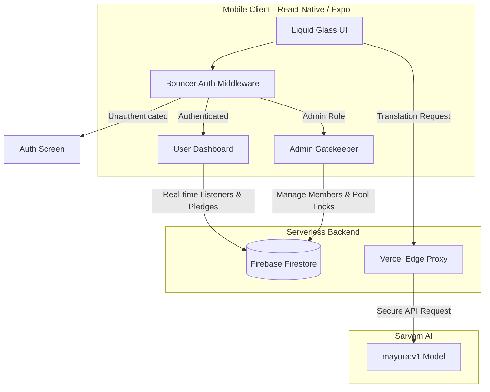

<div align="center">
  <h1>SharedScoop</h1>
  <p><b>Democratizing local wholesale buying power through community-driven supplement pools.</b></p>
  <p>
    
    
    
    
    
  </p>
</div>

---

## ⚡ The Problem & Solution

Minimum Order Quantities (MOQs) restrict individuals from accessing wholesale pricing on high-quality supplements. **SharedScoop** solves this by aggregating local buying power into secure, community-driven pools. Built for **HACKHAZARDS '26**, it features a bespoke "Liquid Glass" design system and a strictly typed React Native frontend, enabling users to combine orders, manage community ledgers, and break down language barriers with localized AI translations.

## 🚀 Core Features

- 🛡️ **The Bouncer (RBAC)**  
  A strict middleware-style layout enforcing Role-Based Access Control. Unauthenticated users are hard-trapped at the Auth gate, while authenticated users are dynamically routed into their respective Firebase community dashboards.
  
- 💧 **The Member Pipeline & "Liquid Glass" UI**  
  Built on a custom neo-morphic UI with dynamic safe-area constraints and frosted glass panels. Approved members view real-time pool progress (total kg committed vs. required) and can actively pledge to SharedScoop pools.
  
- 🔐 **The Admin Gatekeeper**  
  Community admins utilize a dedicated Approval Queue—powered by real-time Firestore listeners—to approve or reject pending members. Admins command the lifecycle, holding the power to "Lock" the pool and trigger the Razorpay closed state.

- 🌐 **On-Demand Contextual Translation (AI)**  
  Integrated with Sarvam AI's `mayura:v1` model, the UI seamlessly translates complex wholesale requirements and pool statuses into local Indic languages (Hindi, Kannada, Tamil, etc.), dismantling language barriers for non-English speakers.

- 🛑 **Secure Proxy Architecture**  
  The mobile client never holds the Sarvam API key. Requests route through a Vercel Edge function with strict CORS headers, preflight handling, and a hard `AbortController` timeout to prevent mobile thread hangs during edge-case network failures.

## 🏗️ System Architecture



## 🛠️ Local Setup & Development

Follow these instructions to run the Expo client and serverless proxy locally.

### 1. Clone & Install
```bash
git clone https://github.com/your-username/shared-scoop.git
cd shared-scoop/shared_scoop
npm install
```

### 2. Environment Configuration
Create a `.env` file at the root of your React Native project and configure the required keys.
```env
# Firebase Configuration
EXPO_PUBLIC_FIREBASE_API_KEY=your_api_key
EXPO_PUBLIC_FIREBASE_AUTH_DOMAIN=your_auth_domain
EXPO_PUBLIC_FIREBASE_PROJECT_ID=your_project_id

# Vercel Proxy URL
EXPO_PUBLIC_VERCEL_URL=https://shared-scoop-backend.vercel.app
```
*(Note: Do **not** place your `SARVAM_API_KEY` in the mobile `.env`. It belongs securely in your Vercel project environment variables).*

### 3. Start the Application
Start the Expo Metro bundler.
```bash
npx expo start
```
Press `i` for the iOS simulator, `a` for Android, or scan the QR code with the Expo Go app.

---
*Developed by Adarsh Singh for HACKHAZARDS '26.*
